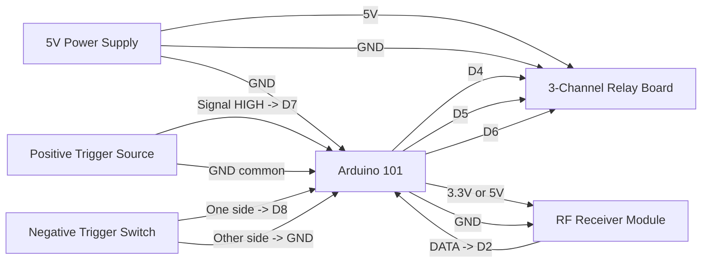

# Arduino 101 Pinout Guide

Target sketch:

- `components/arduino101/Arduino101_Node/Arduino101_Node.ino`

## Function Map

| Function | Arduino 101 Pin | Notes |
| --- | --- | --- |
| RF receiver data | D2 | Must be interrupt-capable for `enableReceive`. |
| Positive trigger input | D7 | Active HIGH input. Wire external source to drive HIGH on trigger. |
| Negative trigger input | D8 | Active LOW input with internal pull-up enabled. Trigger by pulling to GND. Also reprints header text to Serial Monitor. |
| Relay 1 output | D4 | Momentary pulse trigger. |
| Relay 2 output | D5 | Momentary pulse with 15s lockout. |
| Relay 3 output | D6 | Toggle output. |

## Serial Output Path (Important)

- Header and log text is printed on **USB Serial** (`Serial`) through the USB connector.
- No GPIO pin carries the header text.
- Open Arduino IDE Serial Monitor on the board COM port at `115200` baud.
- Pulling D8 LOW triggers the sketch to reprint the header to USB Serial.

## Power and Ground

| Device | Arduino 101 Connection |
| --- | --- |
| RF receiver VCC | 3.3V or 5V (match module spec) |
| RF receiver GND | GND |
| Positive trigger source GND | Common GND with Arduino 101 |
| Negative trigger switch/sensor | Connect between D8 and GND |
| Relay module VCC | External 5V recommended for multi-relay boards |
| Relay module GND | Common GND with Arduino 101 |

## Example Components Required

- 1x Arduino/Genuino 101
- 1x 315/433 MHz RF receiver module (digital data output)
- 1x 3-channel relay module (or three single-relay modules)
- 1x 5V DC power supply sized for relay coil current
- 2x trigger inputs:
  - Positive trigger source for D7 (active HIGH)
  - Negative trigger switch/sensor for D8 to GND (active LOW)
- Jumper wires and terminal blocks as needed
- Optional: 1x 10k resistor for external pull-down on D7 if source can float

## Example Layout Wiring Diagram

### Signal Summary

- D2: RF receiver data input
- D7: positive trigger input, active HIGH
- D8: negative trigger input, active LOW with internal pull-up
- D4: relay 1 pulse output
- D5: relay 2 pulse output with 15-second lockout
- D6: relay 3 toggle output

## Relay Logic

- The sketch is configured for **active LOW** relays.
- `LOW` on D4/D5/D6 energizes the relay.
- If your relay board is active HIGH, change `RELAY_ACTIVE_LOW` to `false`.

## Validation

1. Open Serial Monitor at 115200.
2. Press reset and confirm startup banner and heartbeat messages.
3. Activate D7 and verify `Input trigger: POSITIVE` message.
4. Pull D8 to GND and verify `Input trigger: NEGATIVE` message.
5. Trigger RF transmitter and verify `RF received:` messages.
