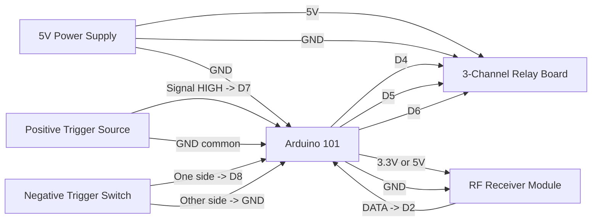

# Arduino 101 Pinout Guide

**Created:** 2026-08-07
**Last Updated:** 2026-08-14

Target sketch:

- `components/arduino101/Arduino101_Node/Arduino101_Node.ino`

## Function Map

| Function               | Arduino 101 Pin | Notes                                                                                                                       |
| ---------------------- | --------------- | --------------------------------------------------------------------------------------------------------------------------- |
| RF receiver data       | D2              | Used for RF configuration/programming. When code `0x00` is received, it triggers Relay 1 only.                             |
| Positive trigger input | D7              | Active HIGH input. Keeps Relay 2 active only while D7 remains HIGH. Use a pull-down resistor so it stays LOW by default. |
| Negative trigger input | D8              | Active LOW input. Keeps Relay 3 active only while D8 remains LOW. Use a pull-up resistor or the internal pull-up.          |
| Relay 1 output         | D4              | Single momentary pulse output for the RF `0x00` trigger and any configured pulse code.                                    |
| Relay 2 output         | D5              | Held active while D7 is HIGH. Not used for RF pulse timing in the current sketch.                                        |
| Relay 3 output         | D6              | Held active while D8 is LOW. Not used for RF pulse timing in the current sketch.                                         |

## Serial Output Path (Important)

- Header and log text is printed on **USB Serial** (`Serial`) through the USB connector.
- No GPIO pin carries the header text.
- Open Arduino IDE Serial Monitor on the board COM port at `115200` baud.
- Pulling D8 LOW triggers the sketch to reprint the header to USB Serial.

## Power and Ground

| Device                         | Arduino 101 Connection                         |
| ------------------------------ | ---------------------------------------------- |
| RF receiver VCC                | 3.3V or 5V (match module spec)                 |
| RF receiver GND                | GND                                            |
| Positive trigger source GND    | Common GND with Arduino 101                    |
| Negative trigger switch/sensor | Connect between D8 and GND                     |
| Relay module VCC               | External 5V recommended for multi-relay boards |
| Relay module GND               | Common GND with Arduino 101                    |

## Board Power Input (Onboard Connector)

| Input Path        | Connector Available | Minimum Input            | Maximum Input             | Notes                                                                                 |
| ----------------- | ------------------- | ------------------------ | ------------------------- | ------------------------------------------------------------------------------------- |
| USB power         | Yes (USB)           | 4.75V                    | 5.25V                     | Preferred for bench setup and programming.                                            |
| Barrel jack / VIN | Yes                 | 7V (recommended minimum) | 12V (recommended maximum) | Board family limit is wider, but 7V to 12V is the practical operating range.          |

## Optional IR Receiver (KY-022 / TL1838 / VS1838B)

### Pinout

- KY-022 signal (S/OUT) -> Arduino 101 D3
- KY-022 GND (-) -> Arduino 101 GND
- KY-022 VCC (+) -> Arduino 101 3.3V

### Required Components

- 1x Arduino/Genuino 101
- 1x KY-022 (TL1838/VS1838B) IR receiver module
- 1x IR remote transmitter (any common NEC-style remote works)
- 3x female-to-female jumper wires

### Wiring

1. Connect KY-022 GND to Arduino 101 GND.
2. Connect KY-022 VCC to Arduino 101 3.3V.
3. Connect KY-022 signal to Arduino 101 D3.
4. Keep existing RF receiver on D2 unchanged.

Note: This node sketch currently does not decode IR. Add an IR library and handler logic before expecting trigger actions from the KY-022.

## Required Components and Resistor Guidance

- 1x Arduino/Genuino 101
- 1x 315/433 MHz RF receiver module (digital data output)
- 1x 3-channel relay module (or three single-relay modules)
- 1x 5V DC power supply sized for relay coil current
- 1x 10k pull-down resistor for D7 to keep the positive trigger line LOW by default
- 1x 10k pull-up resistor for D8 if you are not relying on the internal pull-up or if the triggering device is open collector
- Jumper wires, terminal blocks, and a stable common ground

### Wiring notes for safe signal conditioning

1. Connect the positive trigger source to D7 through a proper signal path, and add a 10k resistor from D7 to GND so the input stays LOW until a real HIGH signal is present.
2. Do not tie D7 directly to 5V without a resistor path to ground; this can short the signal source or leave the line floating during reset.
3. For the negative trigger, wire D8 to a pull-up or use the internal pull-up, and switch the sensor to ground only when active.
4. Keep the relay coil supply and the Arduino ground common, but do not power the relay coil from the same pin supply without appropriate flyback protection.

## Example Layout Wiring Diagram

```mermaid
flowchart LR
  PSU[5V Power Supply]
  A101[Arduino 101]
  RF[RF Receiver Module]
  RLY[3-Channel Relay Board]
  TP[Positive Trigger Source]
  TN[Negative Trigger Switch]

  PSU -->|5V| RLY
  PSU -->|GND| RLY
  PSU -->|GND| A101

  A101 -->|3.3V or 5V| RF
  A101 -->|GND| RF
  RF -->|DATA -> D2| A101

  TP -->|Signal HIGH -> D7| A101
  TP -->|GND common| A101

  TN -->|One side -> D8| A101
  TN -->|Other side -> GND| A101

  A101 -->|D4| RLY
  A101 -->|D5| RLY
  A101 -->|D6| RLY
```

### Signal Summary

- D2: RF receiver data input used for programming.
- D7: positive trigger input, active HIGH. D7 drives Relay 2 only while held HIGH.
- D8: negative trigger input, active LOW. D8 drives Relay 3 only while held LOW.
- D4: relay 1 pulse output for the RF `0x00` trigger and any configured pulse code.
- D5: relay 2 output, active while D7 remains HIGH.
- D6: relay 3 output, active while D8 remains LOW.

## Relay Logic

- The sketch is configured for **active LOW** relays.
- `LOW` on D4/D5/D6 energizes the relay.
- If your relay board is active HIGH, change `RELAY_ACTIVE_LOW` to `false`.
- The current trigger model is level-based for D7 and D8, not pulse-based.

## Validation

1. Open Serial Monitor at 115200.
2. Press reset and confirm startup banner and heartbeat messages.
3. Drive D7 HIGH and verify `Input trigger: POSITIVE -> Relay 2 active while D7 stays HIGH` message.
4. Release D7 and verify Relay 2 turns off.
5. Pull D8 LOW and verify `Input trigger: NEGATIVE -> Relay 3 active while D8 stays LOW` message.
6. Release D8 and verify Relay 3 turns off.
7. Transmit RF code `0x00` and verify Relay 1 pulses once.
8. Confirm the startup banner shows `Default RF timeout: none`.
